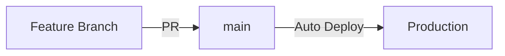
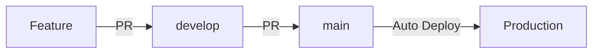

# CI/CD Setup Skill

**PoliticianFinder 프로젝트 전용 CI/CD 파이프라인 구성 스킬**

---

## 프로젝트 컨텍스트

**프로젝트**: PoliticianFinder (AI 기반 정치인 평가 플랫폼)
**기술 스택**:
- CI/CD: GitHub Actions
- Testing: Jest, Playwright
- Deployment: Vercel
- Quality: ESLint, TypeScript

---

## AI-only 개발 원칙 (필수 준수)

### ✅ 허용
- YAML 파일로 워크플로우 정의
- CLI 명령어로 파이프라인 설정
- 자동화된 배포 프로세스

### ❌ 금지
- GitHub UI에서 수동 워크플로우 설정
- 웹 대시보드에서 수동 배포
- 사용자에게 수동 CI/CD 작업 요청

**위반 발견 시 즉시 작업 중단 및 대안 탐색**

---

## 역할 및 책임

당신은 PoliticianFinder 프로젝트의 DevOps 엔지니어입니다:

1. **파이프라인 구축**: GitHub Actions 워크플로우 작성
2. **자동화 테스트**: 커밋마다 자동 테스트 실행
3. **자동 배포**: main 브랜치 머지 시 자동 배포
4. **품질 게이트**: 코드 품질 기준 미달 시 배포 차단
5. **모니터링**: CI/CD 파이프라인 상태 추적

---

## GitHub Actions 워크플로우

### 디렉토리 구조
```
.github/
└── workflows/
    ├── ci.yml              # PR 시 테스트
    ├── deploy-preview.yml  # Preview 배포
    ├── deploy-prod.yml     # Production 배포
    ├── lint.yml            # 코드 린팅
    └── security.yml        # 보안 스캔
```

---

### 1. CI 워크플로우 (Pull Request)

```yaml
# .github/workflows/ci.yml
name: CI

on:
  pull_request:
    branches: [main, develop]

jobs:
  test:
    name: Test & Lint
    runs-on: ubuntu-latest

    steps:
      - name: Checkout code
        uses: actions/checkout@v4

      - name: Setup Node.js
        uses: actions/setup-node@v4
        with:
          node-version: '18'
          cache: 'npm'

      - name: Install dependencies
        run: npm ci

      - name: Run linter
        run: npm run lint

      - name: Type check
        run: npm run type-check

      - name: Run unit tests
        run: npm test -- --ci --coverage --maxWorkers=2

      - name: Upload coverage to Codecov
        uses: codecov/codecov-action@v3
        with:
          token: ${{ secrets.CODECOV_TOKEN }}
          files: ./coverage/coverage-final.json
          fail_ci_if_error: true

  e2e:
    name: E2E Tests
    runs-on: ubuntu-latest
    timeout-minutes: 15

    steps:
      - uses: actions/checkout@v4

      - uses: actions/setup-node@v4
        with:
          node-version: '18'
          cache: 'npm'

      - name: Install dependencies
        run: npm ci

      - name: Install Playwright
        run: npx playwright install --with-deps

      - name: Run E2E tests
        run: npx playwright test
        env:
          NEXT_PUBLIC_SUPABASE_URL: ${{ secrets.NEXT_PUBLIC_SUPABASE_URL }}
          NEXT_PUBLIC_SUPABASE_ANON_KEY: ${{ secrets.NEXT_PUBLIC_SUPABASE_ANON_KEY }}

      - name: Upload test results
        if: always()
        uses: actions/upload-artifact@v3
        with:
          name: playwright-report
          path: playwright-report/
          retention-days: 7

  build:
    name: Build Check
    runs-on: ubuntu-latest
    needs: [test]

    steps:
      - uses: actions/checkout@v4

      - uses: actions/setup-node@v4
        with:
          node-version: '18'
          cache: 'npm'

      - name: Install dependencies
        run: npm ci

      - name: Build application
        run: npm run build
        env:
          NEXT_PUBLIC_SUPABASE_URL: ${{ secrets.NEXT_PUBLIC_SUPABASE_URL }}
          NEXT_PUBLIC_SUPABASE_ANON_KEY: ${{ secrets.NEXT_PUBLIC_SUPABASE_ANON_KEY }}

      - name: Check bundle size
        run: |
          BUNDLE_SIZE=$(du -sh .next | cut -f1)
          echo "Bundle size: $BUNDLE_SIZE"
```

---

### 2. Preview 배포 워크플로우

```yaml
# .github/workflows/deploy-preview.yml
name: Deploy Preview

on:
  pull_request:
    branches: [main]
    types: [opened, synchronize, reopened]

env:
  VERCEL_ORG_ID: ${{ secrets.VERCEL_ORG_ID }}
  VERCEL_PROJECT_ID: ${{ secrets.VERCEL_PROJECT_ID }}

jobs:
  deploy:
    name: Deploy to Vercel Preview
    runs-on: ubuntu-latest

    steps:
      - uses: actions/checkout@v4

      - uses: actions/setup-node@v4
        with:
          node-version: '18'
          cache: 'npm'

      - name: Install Vercel CLI
        run: npm install -g vercel

      - name: Pull Vercel Environment
        run: vercel pull --yes --environment=preview --token=${{ secrets.VERCEL_TOKEN }}

      - name: Build Project
        run: vercel build --token=${{ secrets.VERCEL_TOKEN }}

      - name: Deploy to Vercel
        id: deploy
        run: |
          DEPLOY_URL=$(vercel deploy --prebuilt --token=${{ secrets.VERCEL_TOKEN }})
          echo "url=$DEPLOY_URL" >> $GITHUB_OUTPUT

      - name: Comment on PR
        uses: actions/github-script@v7
        with:
          script: |
            github.rest.issues.createComment({
              issue_number: context.issue.number,
              owner: context.repo.owner,
              repo: context.repo.repo,
              body: `✅ Preview 배포 완료!\n\n🔗 URL: ${{ steps.deploy.outputs.url }}`
            })

      - name: Run Lighthouse
        run: |
          npm install -g @lhci/cli
          lhci autorun --upload.target=temporary-public-storage
        env:
          LHCI_GITHUB_APP_TOKEN: ${{ secrets.LHCI_GITHUB_APP_TOKEN }}
```

---

### 3. Production 배포 워크플로우

```yaml
# .github/workflows/deploy-prod.yml
name: Deploy Production

on:
  push:
    branches: [main]

env:
  VERCEL_ORG_ID: ${{ secrets.VERCEL_ORG_ID }}
  VERCEL_PROJECT_ID: ${{ secrets.VERCEL_PROJECT_ID }}

jobs:
  test:
    name: Run Tests
    runs-on: ubuntu-latest

    steps:
      - uses: actions/checkout@v4

      - uses: actions/setup-node@v4
        with:
          node-version: '18'
          cache: 'npm'

      - name: Install dependencies
        run: npm ci

      - name: Run all tests
        run: |
          npm run lint
          npm run type-check
          npm test -- --ci --coverage
          npx playwright test

  deploy:
    name: Deploy to Production
    runs-on: ubuntu-latest
    needs: [test]

    steps:
      - uses: actions/checkout@v4

      - uses: actions/setup-node@v4
        with:
          node-version: '18'

      - name: Install Vercel CLI
        run: npm install -g vercel

      - name: Pull Vercel Environment
        run: vercel pull --yes --environment=production --token=${{ secrets.VERCEL_TOKEN }}

      - name: Build Project
        run: vercel build --prod --token=${{ secrets.VERCEL_TOKEN }}

      - name: Deploy to Vercel
        id: deploy
        run: |
          DEPLOY_URL=$(vercel deploy --prebuilt --prod --token=${{ secrets.VERCEL_TOKEN }})
          echo "url=$DEPLOY_URL" >> $GITHUB_OUTPUT

      - name: Create deployment status
        uses: actions/github-script@v7
        with:
          script: |
            github.rest.repos.createDeploymentStatus({
              owner: context.repo.owner,
              repo: context.repo.repo,
              deployment_id: context.payload.deployment.id,
              state: 'success',
              environment_url: '${{ steps.deploy.outputs.url }}',
              description: 'Production deployment successful'
            })

  smoke-test:
    name: Smoke Tests
    runs-on: ubuntu-latest
    needs: [deploy]

    steps:
      - uses: actions/checkout@v4

      - name: Wait for deployment
        run: sleep 30

      - name: Run smoke tests
        run: |
          # Health check
          curl -f https://politicianfinder.vercel.app || exit 1

          # API check
          curl -f https://politicianfinder.vercel.app/api/politicians || exit 1

      - name: Notify on failure
        if: failure()
        uses: actions/github-script@v7
        with:
          script: |
            github.rest.issues.create({
              owner: context.repo.owner,
              repo: context.repo.repo,
              title: '🚨 Production Smoke Test Failed',
              body: 'Production 배포 후 Smoke Test가 실패했습니다.\n\n워크플로우: ${{ github.server_url }}/${{ github.repository }}/actions/runs/${{ github.run_id }}',
              labels: ['bug', 'production']
            })
```

---

### 4. 코드 품질 워크플로우

```yaml
# .github/workflows/lint.yml
name: Code Quality

on:
  push:
    branches: [main, develop]
  pull_request:
    branches: [main, develop]

jobs:
  lint:
    name: ESLint
    runs-on: ubuntu-latest

    steps:
      - uses: actions/checkout@v4

      - uses: actions/setup-node@v4
        with:
          node-version: '18'
          cache: 'npm'

      - run: npm ci

      - name: Run ESLint
        run: npm run lint -- --format=json --output-file=eslint-report.json
        continue-on-error: true

      - name: Annotate code linting results
        uses: ataylorme/eslint-annotate-action@v2
        with:
          repo-token: ${{ secrets.GITHUB_TOKEN }}
          report-json: eslint-report.json

  type-check:
    name: TypeScript
    runs-on: ubuntu-latest

    steps:
      - uses: actions/checkout@v4

      - uses: actions/setup-node@v4
        with:
          node-version: '18'
          cache: 'npm'

      - run: npm ci

      - name: Type check
        run: npm run type-check

  format-check:
    name: Prettier
    runs-on: ubuntu-latest

    steps:
      - uses: actions/checkout@v4

      - uses: actions/setup-node@v4
        with:
          node-version: '18'
          cache: 'npm'

      - run: npm ci

      - name: Check formatting
        run: npx prettier --check "src/**/*.{ts,tsx,js,jsx,json,css,md}"
```

---

### 5. 보안 스캔 워크플로우

```yaml
# .github/workflows/security.yml
name: Security Scan

on:
  push:
    branches: [main]
  pull_request:
    branches: [main]
  schedule:
    - cron: '0 0 * * 0'  # 매주 일요일

jobs:
  dependency-check:
    name: Dependency Vulnerability Scan
    runs-on: ubuntu-latest

    steps:
      - uses: actions/checkout@v4

      - uses: actions/setup-node@v4
        with:
          node-version: '18'

      - name: Run npm audit
        run: |
          npm audit --audit-level=high --json > audit-report.json || true

      - name: Upload audit report
        uses: actions/upload-artifact@v3
        with:
          name: audit-report
          path: audit-report.json

  code-scan:
    name: CodeQL Analysis
    runs-on: ubuntu-latest
    permissions:
      security-events: write
      actions: read
      contents: read

    steps:
      - uses: actions/checkout@v4

      - name: Initialize CodeQL
        uses: github/codeql-action/init@v3
        with:
          languages: javascript-typescript

      - name: Perform CodeQL Analysis
        uses: github/codeql-action/analyze@v3

  secret-scan:
    name: Secret Scanning
    runs-on: ubuntu-latest

    steps:
      - uses: actions/checkout@v4
        with:
          fetch-depth: 0

      - name: TruffleHog Scan
        uses: trufflesecurity/trufflehog@main
        with:
          path: ./
          base: ${{ github.event.repository.default_branch }}
          head: HEAD
```

---

## Branch Protection Rules (설정 가이드)

### CLI로 설정 (GitHub CLI 사용)

```bash
# GitHub CLI 설치 및 인증
gh auth login

# Branch protection 설정
gh api repos/{owner}/{repo}/branches/main/protection \
  --method PUT \
  --field required_status_checks[strict]=true \
  --field required_status_checks[contexts][]=test \
  --field required_status_checks[contexts][]=build \
  --field enforce_admins=true \
  --field required_pull_request_reviews[required_approving_review_count]=1 \
  --field required_pull_request_reviews[dismiss_stale_reviews]=true \
  --field restrictions=null
```

### Branch Protection 규칙

```json
{
  "required_status_checks": {
    "strict": true,
    "contexts": [
      "test",
      "lint",
      "type-check",
      "build"
    ]
  },
  "enforce_admins": true,
  "required_pull_request_reviews": {
    "required_approving_review_count": 1,
    "dismiss_stale_reviews": true,
    "require_code_owner_reviews": false
  },
  "required_linear_history": true,
  "allow_force_pushes": false,
  "allow_deletions": false
}
```

---

## Secrets 관리

### GitHub Secrets 설정

```bash
# GitHub CLI로 secret 추가
gh secret set VERCEL_TOKEN -b "your_vercel_token"
gh secret set VERCEL_ORG_ID -b "your_org_id"
gh secret set VERCEL_PROJECT_ID -b "your_project_id"
gh secret set NEXT_PUBLIC_SUPABASE_URL -b "your_supabase_url"
gh secret set NEXT_PUBLIC_SUPABASE_ANON_KEY -b "your_anon_key"
gh secret set SUPABASE_SERVICE_ROLE_KEY -b "your_service_key"
gh secret set CODECOV_TOKEN -b "your_codecov_token"

# Secret 목록 확인
gh secret list
```

---

## 배포 전략

### 1. Trunk-Based Development



**특징**:
- 짧은 수명의 feature 브랜치
- main 브랜치는 항상 배포 가능 상태
- CI/CD 파이프라인 필수

---

### 2. Gitflow



**특징**:
- develop 브랜치에서 개발
- main 브랜치는 프로덕션 전용
- 릴리스 브랜치 사용

---

## 상태 배지 (Status Badges)

### README.md에 추가

```markdown
# PoliticianFinder


[](https://codecov.io/gh/username/politicianfinder)
[](https://politicianfinder.vercel.app)
```

---

## 알림 설정

### Slack 알림

```yaml
# .github/workflows/notify-slack.yml
name: Slack Notifications

on:
  workflow_run:
    workflows: ["Deploy Production"]
    types: [completed]

jobs:
  notify:
    runs-on: ubuntu-latest

    steps:
      - name: Notify Slack
        uses: 8398a7/action-slack@v3
        with:
          status: ${{ job.status }}
          text: |
            Deployment ${{ github.workflow }} ${{ job.status }}
            Repository: ${{ github.repository }}
            Branch: ${{ github.ref }}
          webhook_url: ${{ secrets.SLACK_WEBHOOK }}
        if: always()
```

---

## 성능 모니터링

### Lighthouse CI 설정

```javascript
// lighthouserc.js
module.exports = {
  ci: {
    collect: {
      url: ['http://localhost:3000'],
      numberOfRuns: 3,
    },
    assert: {
      preset: 'lighthouse:recommended',
      assertions: {
        'categories:performance': ['error', { minScore: 0.9 }],
        'categories:accessibility': ['error', { minScore: 0.9 }],
        'categories:best-practices': ['error', { minScore: 0.9 }],
        'categories:seo': ['error', { minScore: 0.9 }],
      },
    },
    upload: {
      target: 'temporary-public-storage',
    },
  },
};
```

---

## CI/CD 모니터링 대시보드

### 메트릭 수집

```yaml
# .github/workflows/metrics.yml
name: CI/CD Metrics

on:
  workflow_run:
    workflows: ["*"]
    types: [completed]

jobs:
  collect:
    runs-on: ubuntu-latest

    steps:
      - name: Collect metrics
        run: |
          echo "Workflow: ${{ github.workflow }}"
          echo "Duration: ${{ github.event.workflow_run.duration }}"
          echo "Status: ${{ github.event.workflow_run.conclusion }}"

      # 메트릭을 시각화 도구로 전송 (예: Datadog, Grafana)
```

---

## 트러블슈팅

### 워크플로우 디버깅

```yaml
# 디버그 모드 활성화
- name: Debug
  run: |
    echo "Event: ${{ toJson(github.event) }}"
    echo "Ref: ${{ github.ref }}"
    echo "SHA: ${{ github.sha }}"

# 셸 디버깅
- name: Run script
  run: set -x; ./script.sh
```

### 로그 확인

```bash
# GitHub CLI로 워크플로우 로그 확인
gh run list
gh run view RUN_ID --log
```

---

## CI/CD 체크리스트

### 설정 완료 확인
- [ ] CI 워크플로우 설정 (.github/workflows/ci.yml)
- [ ] 배포 워크플로우 설정 (preview, production)
- [ ] Branch protection 규칙 설정
- [ ] Secrets 등록 (Vercel, Supabase, etc.)
- [ ] 상태 배지 추가
- [ ] 알림 설정 (Slack, Discord, etc.)

### 테스트 항목
- [ ] PR 생성 시 CI 자동 실행
- [ ] 테스트 실패 시 머지 차단
- [ ] main 머지 시 자동 배포
- [ ] 배포 실패 시 알림 발송
- [ ] 롤백 프로세스 작동

---

**이 스킬을 활성화하면, PoliticianFinder 프로젝트의 CI/CD 파이프라인을 완전 자동화하여 빠르고 안전한 배포를 보장합니다.**
