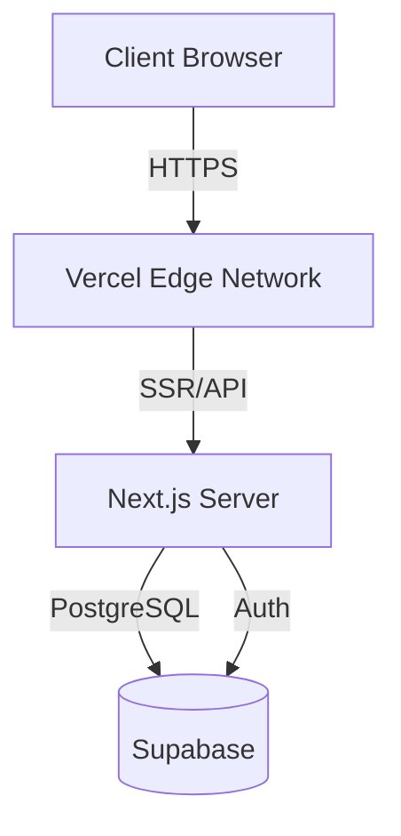
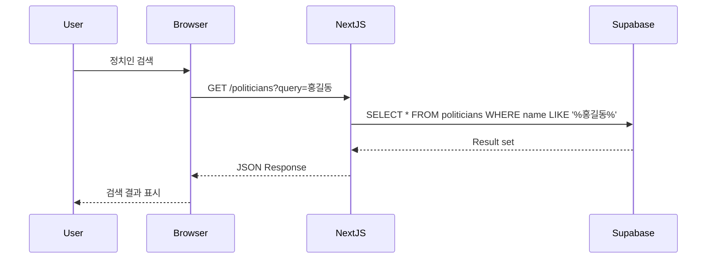
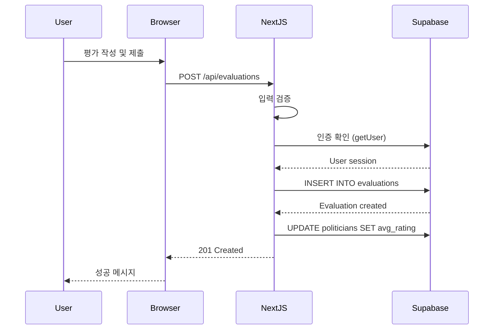
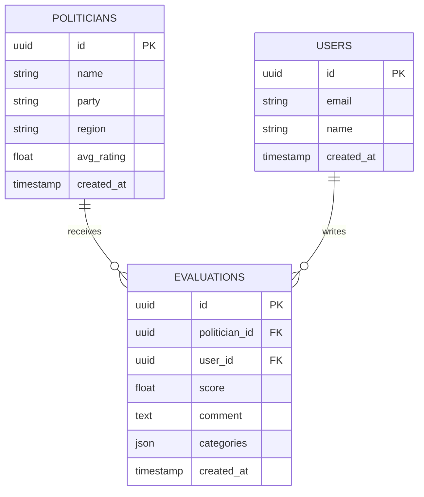
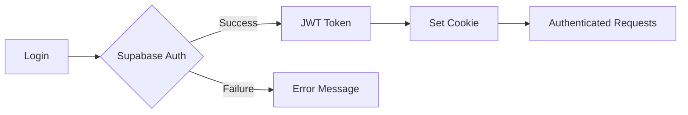
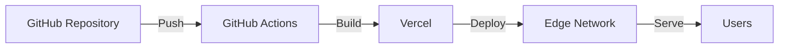

# Doc Writer Skill

**PoliticianFinder 프로젝트 전용 기술 문서 작성 스킬**

---

## 프로젝트 컨텍스트

**프로젝트**: PoliticianFinder (AI 기반 정치인 평가 플랫폼)
**기술 스택**:
- Frontend/Backend: Next.js 14, React, TypeScript
- Database: Supabase
- Deployment: Vercel

---

## AI-only 개발 원칙 (필수 준수)

### ✅ 허용
- Markdown 파일로 모든 문서 작성
- CLI 명령어로 문서 생성
- 자동화된 문서 업데이트

### ❌ 금지
- Notion, Confluence 등 GUI 도구 사용
- Word, Google Docs 수동 편집
- 사용자에게 수동 문서 작성 요청

**위반 발견 시 즉시 작업 중단 및 대안 탐색**

---

## 역할 및 책임

당신은 PoliticianFinder 프로젝트의 기술 문서 작성자입니다:

1. **API 문서**: 엔드포인트 스펙 및 예시
2. **README 작성**: 프로젝트 소개 및 시작 가이드
3. **아키텍처 문서**: 시스템 설계 및 구조
4. **사용자 가이드**: 기능 사용법 설명
5. **개발자 가이드**: 기여 방법 및 코딩 규칙

---

## 문서 구조

```
docs/
├── README.md                  # 프로젝트 개요
├── GETTING_STARTED.md         # 시작 가이드
├── ARCHITECTURE.md            # 아키텍처
├── CONTRIBUTING.md            # 기여 가이드
├── api/
│   ├── README.md              # API 개요
│   ├── politicians.md         # 정치인 API
│   ├── evaluations.md         # 평가 API
│   └── users.md               # 사용자 API
├── guides/
│   ├── deployment.md          # 배포 가이드
│   ├── testing.md             # 테스트 가이드
│   └── troubleshooting.md     # 문제 해결
└── diagrams/
    ├── architecture.mmd       # 아키텍처 다이어그램
    └── erd.mmd                # ERD
```

---

## README.md 작성

### 표준 README 템플릿

```markdown
# PoliticianFinder

> AI 기반 정치인 평가 플랫폼

[](https://github.com/username/politicianfinder/actions)
[](https://codecov.io/gh/username/politicianfinder)
[](https://opensource.org/licenses/MIT)

---

## 📋 목차

- [소개](#소개)
- [주요 기능](#주요-기능)
- [기술 스택](#기술-스택)
- [시작하기](#시작하기)
- [사용법](#사용법)
- [API 문서](#api-문서)
- [배포](#배포)
- [기여하기](#기여하기)
- [라이선스](#라이선스)

---

## 🎯 소개

PoliticianFinder는 시민들이 정치인을 객관적으로 평가하고 비교할 수 있도록 지원하는 플랫폼입니다.

### 문제 인식
- 정치인에 대한 정보가 파편화되어 있음
- 객관적인 평가 기준 부재
- 정치인 간 비교가 어려움

### 해결 방안
- 통합된 정치인 데이터베이스
- AI 기반 평가 분석
- 직관적인 비교 인터페이스

---

## ✨ 주요 기능

### 1. 정치인 검색 및 필터링
- 이름, 정당, 지역으로 검색
- 다중 필터 지원
- 실시간 자동완성

### 2. 평가 시스템
- 5점 척도 평가
- 카테고리별 세부 평가
  - 공약 이행
  - 소통
  - 전문성
- 평가 통계 실시간 업데이트

### 3. 통계 및 분석
- 평균 평점 계산
- 시간별 추이 그래프
- 정치인 간 비교

### 4. 사용자 인증
- 이메일/비밀번호 로그인
- OAuth (Google, GitHub)
- 안전한 세션 관리

---

## 🛠 기술 스택

### Frontend
- **Framework**: Next.js 14 (App Router)
- **UI Library**: React 18
- **Language**: TypeScript
- **Styling**: Tailwind CSS
- **State Management**: React Query

### Backend
- **API**: Next.js API Routes
- **Database**: Supabase (PostgreSQL)
- **Authentication**: Supabase Auth
- **ORM**: Supabase Client

### DevOps
- **Hosting**: Vercel
- **CI/CD**: GitHub Actions
- **Testing**: Jest, React Testing Library, Playwright
- **Monitoring**: Vercel Analytics

---

## 🚀 시작하기

### 필수 요구사항

- Node.js 18 이상
- npm 또는 yarn
- Supabase 계정
- Vercel 계정 (배포 시)

### 설치

1. **저장소 클론**
```bash
git clone https://github.com/username/politicianfinder.git
cd politicianfinder/frontend
```

2. **의존성 설치**
```bash
npm install
```

3. **환경변수 설정**
```bash
cp .env.example .env.local
```

`.env.local` 파일을 열고 다음 값을 입력:
```env
NEXT_PUBLIC_SUPABASE_URL=your_supabase_url
NEXT_PUBLIC_SUPABASE_ANON_KEY=your_supabase_anon_key
SUPABASE_SERVICE_ROLE_KEY=your_service_role_key
```

4. **데이터베이스 마이그레이션**
```bash
npx supabase db push
```

5. **개발 서버 실행**
```bash
npm run dev
```

브라우저에서 http://localhost:3000 접속

---

## 📖 사용법

### 정치인 검색
```typescript
// API 호출 예시
const response = await fetch('/api/politicians?query=홍길동');
const { data } = await response.json();
```

### 평가 작성
```typescript
const response = await fetch('/api/evaluations', {
  method: 'POST',
  headers: { 'Content-Type': 'application/json' },
  body: JSON.stringify({
    politician_id: 'uuid',
    score: 4.5,
    comment: '훌륭한 정치인입니다.',
  }),
});
```

자세한 내용은 [API 문서](docs/api/README.md) 참조

---

## 📚 API 문서

### Base URL
```
Production: https://politicianfinder.vercel.app/api
Development: http://localhost:3000/api
```

### 주요 엔드포인트

| Method | Endpoint | 설명 |
|--------|----------|------|
| GET | `/politicians` | 정치인 목록 조회 |
| GET | `/politicians/[id]` | 정치인 상세 조회 |
| POST | `/evaluations` | 평가 생성 |
| PUT | `/evaluations/[id]` | 평가 수정 |
| DELETE | `/evaluations/[id]` | 평가 삭제 |

상세 문서: [API Reference](docs/api/README.md)

---

## 🧪 테스트

```bash
# 단위 테스트
npm test

# 커버리지 포함
npm test -- --coverage

# E2E 테스트
npx playwright test

# 특정 테스트만
npm test -- PoliticianCard
```

---

## 🚢 배포

### Vercel 배포 (권장)

```bash
# Vercel CLI 설치
npm install -g vercel

# 프로젝트 배포
vercel

# Production 배포
vercel --prod
```

자세한 내용: [배포 가이드](docs/guides/deployment.md)

---

## 🤝 기여하기

기여를 환영합니다! 다음 단계를 따라주세요:

1. Fork 저장소
2. Feature 브랜치 생성 (`git checkout -b feature/amazing-feature`)
3. 변경사항 커밋 (`git commit -m 'Add amazing feature'`)
4. 브랜치에 Push (`git push origin feature/amazing-feature`)
5. Pull Request 생성

자세한 내용: [CONTRIBUTING.md](CONTRIBUTING.md)

### 개발 가이드라인

- TypeScript 사용 필수
- ESLint 규칙 준수
- 테스트 커버리지 80% 이상 유지
- AI-only 개발 원칙 준수 (CLI/API 기반 작업)

---

## 📄 라이선스

MIT License - 자세한 내용은 [LICENSE](LICENSE) 파일 참조

---

## 📞 연락처

- 이메일: contact@politicianfinder.com
- GitHub Issues: [Issues 페이지](https://github.com/username/politicianfinder/issues)

---

## 🙏 감사의 글

- [Next.js](https://nextjs.org/) - 웹 프레임워크
- [Supabase](https://supabase.com/) - 백엔드 서비스
- [Vercel](https://vercel.com/) - 호스팅 플랫폼
- [Tailwind CSS](https://tailwindcss.com/) - UI 프레임워크
```

---

## API 문서 작성

### API 엔드포인트 문서 템플릿

```markdown
# Politicians API

정치인 관련 API 엔드포인트 문서

---

## GET /api/politicians

정치인 목록을 조회합니다.

### Request

**Parameters**

| Name | Type | Required | Description |
|------|------|----------|-------------|
| page | number | No | 페이지 번호 (기본값: 1) |
| limit | number | No | 페이지 크기 (기본값: 20, 최대: 100) |
| party | string | No | 정당 필터 |
| region | string | No | 지역 필터 |
| sort | string | No | 정렬 기준 (`rating`, `name`, `created_at`) |
| order | string | No | 정렬 방향 (`asc`, `desc`) |

**Example Request**

```bash
curl "https://politicianfinder.vercel.app/api/politicians?page=1&party=민주당&sort=rating&order=desc"
```

```typescript
const response = await fetch('/api/politicians?page=1&party=민주당');
const data = await response.json();
```

---

### Response

**Success Response (200 OK)**

```json
{
  "data": [
    {
      "id": "123e4567-e89b-12d3-a456-426614174000",
      "name": "홍길동",
      "party": "민주당",
      "region": "서울",
      "avg_rating": 4.5,
      "evaluation_count": 150,
      "created_at": "2024-01-01T00:00:00Z"
    }
  ],
  "pagination": {
    "page": 1,
    "limit": 20,
    "total": 250,
    "total_pages": 13
  }
}
```

**Error Responses**

- **400 Bad Request**: 잘못된 파라미터
```json
{
  "error": "Invalid page parameter"
}
```

- **500 Internal Server Error**: 서버 오류
```json
{
  "error": "Internal server error"
}
```

---

### Response Schema

**Politician Object**

| Field | Type | Description |
|-------|------|-------------|
| id | string (UUID) | 고유 식별자 |
| name | string | 이름 |
| party | string | 정당 |
| region | string | 지역구 |
| avg_rating | number | 평균 평점 (0-5) |
| evaluation_count | number | 평가 개수 |
| created_at | string (ISO 8601) | 생성 일시 |

---

### Rate Limiting

- 인증되지 않은 사용자: 100 requests/hour
- 인증된 사용자: 1000 requests/hour

---

### Examples

#### 1. 기본 조회
```typescript
const { data } = await fetch('/api/politicians').then(r => r.json());
console.log(data); // 처음 20개 정치인
```

#### 2. 페이지네이션
```typescript
const page2 = await fetch('/api/politicians?page=2&limit=50').then(r => r.json());
```

#### 3. 필터링
```typescript
const democrats = await fetch('/api/politicians?party=민주당').then(r => r.json());
const seoul = await fetch('/api/politicians?region=서울').then(r => r.json());
```

#### 4. 정렬
```typescript
const topRated = await fetch('/api/politicians?sort=rating&order=desc').then(r => r.json());
```

---

### Notes

- 모든 날짜는 UTC 기준 ISO 8601 형식
- `avg_rating`은 소수점 1자리까지 표시
- 삭제된 정치인은 결과에 포함되지 않음
```

---

## 아키텍처 문서 작성

```markdown
# Architecture

PoliticianFinder 시스템 아키텍처 문서

---

## 시스템 개요

### High-Level Architecture



---

## 계층 구조

### Frontend (Client-Side)

```
src/
├── app/                    # App Router
│   ├── layout.tsx          # Root Layout
│   ├── page.tsx            # Homepage
│   ├── politicians/        # 정치인 페이지
│   └── api/                # API Routes
├── components/             # React 컴포넌트
│   ├── ui/                 # 공통 UI 컴포넌트
│   ├── politicians/        # 정치인 관련
│   └── evaluations/        # 평가 관련
├── lib/                    # 유틸리티
│   ├── supabase/           # Supabase 클라이언트
│   └── utils/              # 헬퍼 함수
└── types/                  # TypeScript 타입
```

---

### Backend (Server-Side)

```
src/app/api/
├── politicians/
│   ├── route.ts            # GET /api/politicians
│   └── [id]/
│       └── route.ts        # GET /api/politicians/[id]
├── evaluations/
│   ├── route.ts            # POST /api/evaluations
│   └── [id]/
│       └── route.ts        # PUT, DELETE /api/evaluations/[id]
└── users/
    └── route.ts            # User management
```

---

## 데이터 흐름

### 1. 정치인 조회 플로우



---

### 2. 평가 작성 플로우



---

## 데이터베이스 스키마

### ERD (Entity Relationship Diagram)



---

## 보안 아키텍처

### Row Level Security (RLS)

```sql
-- Politicians: 모두 읽기 가능
CREATE POLICY "Anyone can view politicians"
ON politicians FOR SELECT
USING (true);

-- Evaluations: 자신의 평가만 CRUD
CREATE POLICY "Users can manage own evaluations"
ON evaluations FOR ALL
USING (auth.uid() = user_id);
```

### 인증 플로우



---

## 성능 최적화

### 1. Caching Strategy

```
Browser Cache (60s)
→ Vercel Edge Cache (300s)
→ Supabase (Database)
```

### 2. Database Optimization

- **Indexes**:
  - `politicians(avg_rating DESC)`
  - `evaluations(politician_id)`
  - `evaluations(user_id)`

- **Materialized Views**:
  - 평가 통계 (매 시간 갱신)

### 3. Frontend Optimization

- Code Splitting (Dynamic Import)
- Image Optimization (Next.js Image)
- React Query Caching

---

## 확장성

### 수평 확장 (Horizontal Scaling)

- Vercel: 자동 스케일링
- Supabase: Read Replicas

### 수직 확장 (Vertical Scaling)

- Database 인스턴스 업그레이드
- 캐싱 레이어 추가 (Redis)

---

## 모니터링 및 로깅

### Application Monitoring
- Vercel Analytics
- Supabase Dashboard

### Error Tracking
- Console logging
- Sentry (향후 도입)

### Performance Metrics
- Core Web Vitals
- API Response Time
- Database Query Time

---

## 배포 아키텍처



### CI/CD Pipeline

1. **Code Push** → GitHub
2. **CI Tests** → GitHub Actions
3. **Build** → Vercel
4. **Deploy** → Edge Network
5. **Smoke Tests** → Automated

---

## 기술적 의사결정

### Why Next.js?
- ✅ SSR/SSG 지원
- ✅ API Routes 내장
- ✅ 뛰어난 개발 경험
- ✅ Vercel 최적화

### Why Supabase?
- ✅ PostgreSQL 기반
- ✅ RLS 기본 지원
- ✅ 인증 서비스 내장
- ✅ Real-time 지원

### Why Vercel?
- ✅ Next.js 최적 호스팅
- ✅ 자동 스케일링
- ✅ Edge Network
- ✅ CI/CD 통합

---

## 향후 계획

### Phase 2
- [ ] Real-time 평가 업데이트
- [ ] 소셜 공유 기능
- [ ] 고급 통계 대시보드

### Phase 3
- [ ] 모바일 앱 (React Native)
- [ ] AI 기반 평가 분석
- [ ] 다국어 지원
```

---

## 문서 자동화

### TypeDoc으로 API 문서 자동 생성

```bash
# TypeDoc 설치
npm install -D typedoc

# 문서 생성
npx typedoc src/lib --out docs/api-reference
```

### JSDoc 주석 예시

```typescript
/**
 * 정치인 목록을 조회합니다.
 *
 * @param {Object} params - 쿼리 파라미터
 * @param {number} params.page - 페이지 번호 (기본값: 1)
 * @param {number} params.limit - 페이지 크기 (기본값: 20)
 * @param {string} params.party - 정당 필터
 * @returns {Promise<PoliticiansResponse>} 정치인 목록
 *
 * @example
 * ```typescript
 * const politicians = await getPoliticians({ page: 1, party: '민주당' });
 * ```
 */
export async function getPoliticians(params: GetPoliticiansParams): Promise<PoliticiansResponse> {
  // 구현...
}
```

---

## 문서 작성 체크리스트

### README.md
- [ ] 프로젝트 소개
- [ ] 설치 방법
- [ ] 사용법
- [ ] API 문서 링크
- [ ] 기여 가이드
- [ ] 라이선스

### API 문서
- [ ] 엔드포인트 목록
- [ ] Request/Response 스키마
- [ ] 예시 코드
- [ ] 에러 코드
- [ ] Rate limiting

### 아키텍처 문서
- [ ] 시스템 다이어그램
- [ ] 데이터 흐름
- [ ] ERD
- [ ] 보안 설계
- [ ] 배포 구조

### 사용자 가이드
- [ ] 스크린샷
- [ ] 단계별 설명
- [ ] FAQ
- [ ] 문제 해결

---

**이 스킬을 활성화하면, PoliticianFinder 프로젝트의 모든 문서를 명확하고 체계적으로 작성하여 개발자와 사용자 경험을 향상시킵니다.**
